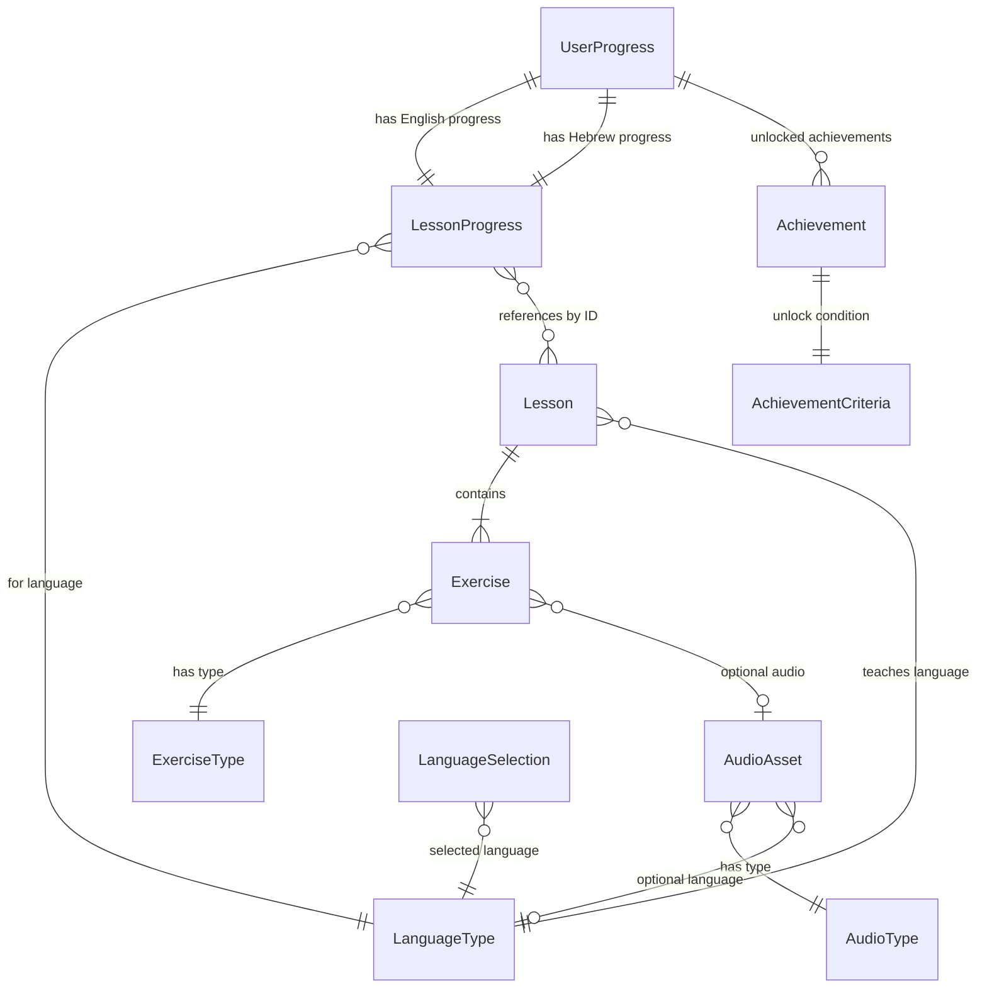

# Data Model: Entities & Relationships

**Feature**: 001-duolingo-game  
**Date**: 2025-12-04  
**Purpose**: Define domain entities, relationships, and validation rules for the language learning game

## Entity Definitions

### 1. UserProgress

Tracks the user's overall game progress across all languages.

**Fields**:

- `totalPoints`: int - Total points accumulated across all completed lessons
- `currentStreak`: int - Number of consecutive days with at least one completed lesson
- `longestStreak`: int - Historical maximum streak count
- `lastPracticeDate`: DateTime - Date of most recent lesson completion
- `unlockedAchievements`: List<Achievement> - Achievements earned by the user
- `englishProgress`: LessonProgress - Progress tracking for English lessons
- `hebrewProgress`: LessonProgress - Progress tracking for Hebrew lessons

**Validation Rules**:

- `totalPoints` >= 0
- `currentStreak` >= 0, <= `longestStreak`
- `lastPracticeDate` cannot be in the future
- `unlockedAchievements` contains only unique achievements (no duplicates)

**Business Logic**:

- Streak resets to 0 if current date > `lastPracticeDate` + 1 day
- Streak increments when lesson completed on new calendar day
- `longestStreak` updated when `currentStreak` exceeds it

---

### 2. Lesson

Represents a single learning unit for a specific language.

**Fields**:

- `id`: String - Unique identifier (e.g., "english_lesson_001")
- `language`: LanguageType (enum: english, hebrew) - Target language for this lesson
- `level`: int - Difficulty level (1-5, where 1 = beginner, 5 = advanced)
- `title`: String - User-facing lesson name (e.g., "Greetings", "Numbers 1-10")
- `description`: String - Brief description of lesson content
- `exercises`: List<Exercise> - Ordered list of exercises in this lesson
- `requiredAccuracy`: double - Minimum accuracy (0.0-1.0) to earn 3 stars
- `timeLimit`: Duration? - Optional time limit for bonus points (null = no limit)
- `prerequisiteIds`: List<String> - Lesson IDs that must be completed first (empty if no prerequisites)
- `pointValue`: int - Base points awarded for completing lesson

**Validation Rules**:

- `id` must be non-empty and unique across all lessons
- `language` must be valid enum value
- `level` must be 1-5 inclusive
- `title` and `description` must be non-empty
- `exercises` must contain at least 1 exercise
- `requiredAccuracy` must be 0.0-1.0
- `pointValue` must be > 0

**Relationships**:

- Has many `Exercise` objects (composition)
- Referenced by `LessonProgress.completedLessonIds`
- Referenced by `prerequisiteIds` of other Lessons

---

### 3. Exercise

Individual question/task within a lesson.

**Fields**:

- `id`: String - Unique identifier (e.g., "ex_eng_001_q01")
- `type`: ExerciseType (enum: multipleChoice, fillInBlank, matching, listening)
- `questionText`: String - The question or prompt displayed to user
- `questionAudio`: String? - Optional audio file path for listening exercises
- `answerOptions`: List<String> - Possible answers (for multiple choice, matching)
- `correctAnswer`: String - The correct answer
- `explanation`: String? - Optional explanation shown after answer (for learning reinforcement)
- `points`: int - Points awarded for correct answer (10-50 based on difficulty)
- `hints`: List<String>? - Optional hints available to user (may reduce points if used)

**Validation Rules**:

- `id` must be non-empty and unique within parent Lesson
- `type` must be valid enum value
- `questionText` must be non-empty
- `answerOptions` required for multipleChoice and matching types
- `correctAnswer` must be non-empty
- `points` must be 10-50
- For `multipleChoice`: `answerOptions` must contain `correctAnswer`
- For `fillInBlank`: `answerOptions` can be empty (user types answer)
- For `listening`: `questionAudio` must be non-null

**Enum Types**:

```dart
enum ExerciseType {
  multipleChoice,  // Select one answer from options
  fillInBlank,     // Type the correct word/phrase
  matching,        // Match pairs (e.g., word to translation)
  listening,       // Listen to audio and select/type answer
}
```

---

### 4. Achievement

Milestone reward for reaching specific goals.

**Fields**:

- `id`: String - Unique identifier (e.g., "first_lesson", "100_points")
- `name`: String - User-facing achievement name (e.g., "First Steps", "Century Club")
- `description`: String - What the user accomplished
- `iconPath`: String - Path to achievement icon asset
- `unlockedAt`: DateTime? - When user earned this (null if not unlocked yet)
- `criteria`: AchievementCriteria - Condition to unlock this achievement

**AchievementCriteria** (Union type/sealed class):

```dart
// Examples of criteria types
- PointsReached(threshold: 100)  // Total points >= threshold
- StreakReached(days: 7)         // Current streak >= days
- LessonsCompleted(count: 5)     // Total lessons completed >= count
- LanguageCompleted(language: LanguageType)  // All lessons for language done
```

**Validation Rules**:

- `id`, `name`, `description`, `iconPath` must be non-empty
- `unlockedAt` cannot be in the future
- `criteria` must be a valid criteria type

**State Transitions**:

- Locked → Unlocked (when criteria met)
- Once unlocked, cannot revert to locked

---

### 5. AudioAsset

Represents a sound effect, music track, or pronunciation audio file.

**Fields**:

- `id`: String - Unique identifier
- `type`: AudioType (enum: soundEffect, music, pronunciation)
- `filePath`: String - Asset path (e.g., "assets/audio/sfx/correct_answer.mp3")
- `language`: LanguageType? - Language for pronunciation audio (null for SFX/music)
- `duration`: Duration - Length of audio clip
- `isPreloaded`: bool - Whether this audio should be loaded at app start

**Enum Types**:

```dart
enum AudioType {
  soundEffect,   // Button taps, correct/wrong answers, etc.
  music,         // Background music
  pronunciation, // Word/phrase pronunciation
}
```

**Validation Rules**:

- `id` must be non-empty
- `filePath` must be valid asset path
- `language` required if `type` == pronunciation, null otherwise
- `duration` must be > Duration.zero
- `isPreloaded` should be true for all soundEffect types

**Usage**:

- SFX: All preloaded at app start for instant playback
- Music: Loaded on-demand when screen appears
- Pronunciation: Loaded when lesson starts (cached for lesson duration)

---

### 6. LanguageSelection

Represents the user's currently selected language for learning.

**Fields**:

- `selectedLanguage`: LanguageType (enum: english, hebrew)
- `availableLanguages`: List<LanguageType> - Languages offered in the app

**Enum Types**:

```dart
enum LanguageType {
  english,
  hebrew,
}
```

**Validation Rules**:

- `selectedLanguage` must be in `availableLanguages`
- `availableLanguages` must contain at least 1 language

**State Transitions**:

- User can switch `selectedLanguage` at any time from main menu
- Switching updates UI to show corresponding lesson map and content

---

### 7. SettingsPreferences

User-configurable app settings.

**Fields**:

- `soundEffectsVolume`: int - Volume level 0-100 for SFX
- `musicVolume`: int - Volume level 0-100 for background music
- `notificationsEnabled`: bool - Daily practice reminder toggle
- `selectedTheme`: String? - Future: theme selection (null = default Candy Crush style)

**Validation Rules**:

- `soundEffectsVolume` must be 0-100
- `musicVolume` must be 0-100
- `notificationsEnabled` is always valid (boolean)

**Persistence**:

- Stored in SharedPreferences (key-value pairs)
- Loaded at app start
- Changes applied immediately and persisted

---

### 8. LessonProgress

Tracks progress for a specific language.

**Fields**:

- `language`: LanguageType - Which language this tracks
- `completedLessonIds`: List<String> - IDs of completed lessons
- `currentLessonId`: String? - ID of lesson in progress (null if none)
- `starsEarned`: Map<String, int> - Lesson ID → stars earned (1-3)
- `totalLessonsAvailable`: int - Total number of lessons for this language

**Validation Rules**:

- `completedLessonIds` contains only unique IDs
- `starsEarned` keys must be subset of `completedLessonIds`
- Star values must be 1-3
- `totalLessonsAvailable` must be > 0

**Derived Properties** (computed, not stored):

- `completionPercentage`: double - `completedLessonIds.length / totalLessonsAvailable * 100`
- `isFullyCompleted`: bool - `completedLessonIds.length == totalLessonsAvailable`

---

## Entity Relationships



**Key Relationships**:

1. **UserProgress → LessonProgress**: One-to-one for each language (English, Hebrew)
2. **UserProgress → Achievement**: One-to-many (user can unlock multiple achievements)
3. **Lesson → Exercise**: One-to-many composition (lesson owns exercises)
4. **Exercise → AudioAsset**: Optional association (listening exercises reference audio)
5. **LessonProgress → Lesson**: Many-to-many reference via IDs (tracks completed lessons)

---

## State Transitions

### Lesson Completion Flow

```
Lesson State Transitions:
1. Locked (prerequisite not met)
2. Available (prerequisite met, not started)
3. In Progress (started but not completed)
4. Completed (all exercises finished)

Exercise State Transitions:
1. Not Attempted
2. Incorrect (can retry)
3. Correct (points awarded, move to next)
```

### Streak Calculation Logic

```dart
// Pseudo-code for streak calculation
if (current date == lastPracticeDate) {
  // Same day practice, no change
} else if (current date == lastPracticeDate + 1 day) {
  // Next day practice, increment streak
  currentStreak++
  if (currentStreak > longestStreak) {
    longestStreak = currentStreak
  }
} else {
  // Missed a day, reset streak
  currentStreak = 1
}
lastPracticeDate = current date
```

### Points Accumulation

```dart
// Points awarded for lesson completion
basePoints = sum of all exercise points in lesson
accuracyBonus = (accuracy > requiredAccuracy) ? (accuracy * 50) : 0
speedBonus = (completed under timeLimit) ? 100 : 0

totalPoints += basePoints + accuracyBonus + speedBonus
```

---

## Validation Examples

### Valid Lesson Example

```dart
Lesson(
  id: 'english_lesson_001',
  language: LanguageType.english,
  level: 1,
  title: 'Greetings',
  description: 'Learn basic English greetings',
  exercises: [
    Exercise(
      id: 'ex_eng_001_q01',
      type: ExerciseType.multipleChoice,
      questionText: 'How do you say "hello" in English?',
      answerOptions: ['Hello', 'Goodbye', 'Thank you'],
      correctAnswer: 'Hello',
      points: 10,
    ),
    // ... more exercises
  ],
  requiredAccuracy: 0.7,
  timeLimit: null,
  prerequisiteIds: [],
  pointValue: 50,
)
```

### Valid UserProgress Example

```dart
UserProgress(
  totalPoints: 350,
  currentStreak: 5,
  longestStreak: 12,
  lastPracticeDate: DateTime(2025, 12, 4),
  unlockedAchievements: [
    Achievement(id: 'first_lesson', ...),
    Achievement(id: '100_points', ...),
  ],
  englishProgress: LessonProgress(
    language: LanguageType.english,
    completedLessonIds: ['english_lesson_001', 'english_lesson_002'],
    currentLessonId: 'english_lesson_003',
    starsEarned: {'english_lesson_001': 3, 'english_lesson_002': 2},
    totalLessonsAvailable: 30,
  ),
  hebrewProgress: LessonProgress(
    language: LanguageType.hebrew,
    completedLessonIds: [],
    currentLessonId: null,
    starsEarned: {},
    totalLessonsAvailable: 25,
  ),
)
```

---

## Data Model Complete

All entities defined with validations, relationships, and state transitions. Ready for implementation in domain layer (`lib/features/*/domain/entities/`).
